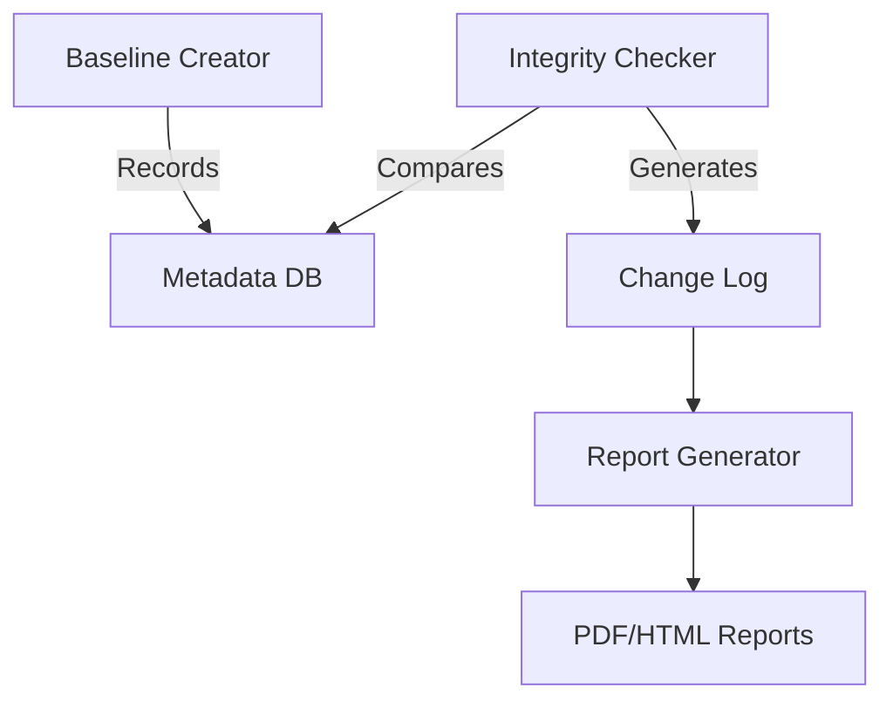

```markdown
# 🔍 File Integrity Checker


A lightweight security tool that monitors file system changes by comparing current states against cryptographic baselines.

---

## 🌟 Key Features

| Feature | Description |
|---------|-------------|
| **📸 Baseline Snapshots** | Records complete directory structures and file metadata |
| **🔎 Change Detection** | Identifies modifications against baselines with 9-point verification |
| **📊 Smart Reporting** | Prioritizes changes by severity (Critical/Medium/Low) |
| **⏱️ Automated Monitoring** | Ready for cron job scheduling |
| **🌐 Cross-Platform** | Works everywhere Bash runs |

---
```

##🚀 Quick Start
### 1. Installation
```bash
git clone https://github.com/yourusername/file-integrity-checker.git
cd file-integrity-checker
chmod +x *.sh
```


### 2. First Run
```bash
./main.sh
```
*For system directories:*  
```bash
sudo ./main.sh
```

---

## 🖥️ Interactive Guide

### 📂 Creating Baselines
1. Select `[1] Create Baseline`
2. Enter absolute path (e.g., `/etc/nginx`)
3. Find your baseline in `./Baselines/`

### 🔍 Running Checks
1. Select `[2] Run Integrity Check`
2. Confirm with `y`
3. Enter same path as baseline
4. Results saved to `./Reports/temp_Report.txt`

### 📝 Generating Reports
1. Select `[3] Generate Report`  
2. Name your report (e.g., `webserver_audit`)  
3. Get formatted PDF in `./Reports/`

---

## 🕵️ Understanding Output

```diff
! CRITICAL (Flags 2,4,5)
- Permission changes (chmod)
- Ownership changes (chown)
- Inode modifications

~ MEDIUM (Flags 3,6) 
- Hard link alterations
- File size changes

• LOW (Flag 9)
- Timestamp updates
```

---

## 🏗️ Technical Architecture



---

## 💡 Example Workflow

1. Baseline your web server config:
   ```bash
   ./main.sh  # Select [1], enter /etc/nginx
   ```
2. After making changes:
   ```bash
   ./main.sh  # Select [2], same path
   ```
3. Generate audit report:
   ```bash
   ./main.sh  # Select [3], name "nginx_check"
   ```

---

## 🤝 Contributing

We welcome contributions! Please:
1. Fork the repository
2. Create a feature branch
3. Submit a PR with tests

---

## 📜 License

MIT © 2025 Aniket rai
```

